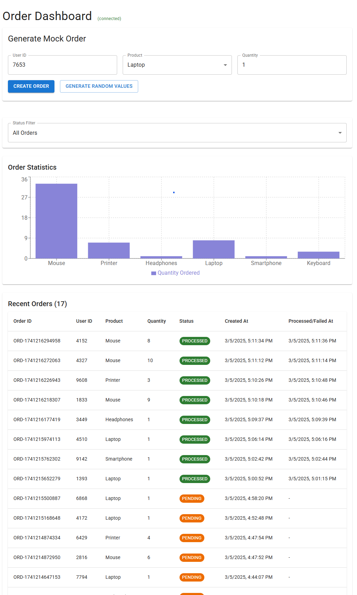
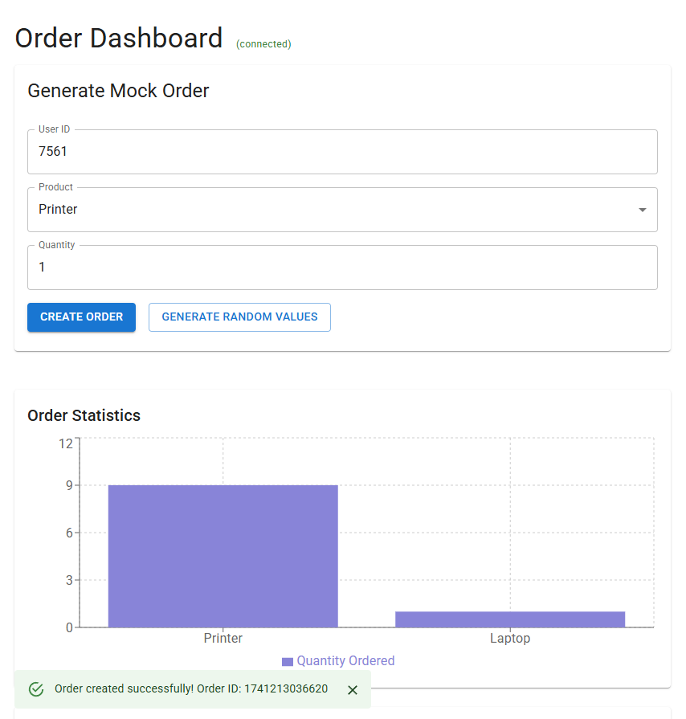
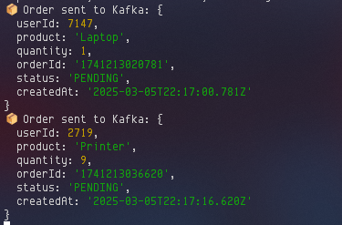

# Real-time Order Processing System with Kafka & Redis

A scalable, real-time order processing system built with microservices architecture, using Kafka for event streaming and MongoDB for data persistence. This system demonstrates advanced order management capabilities with real-time status updates, filtering, and comprehensive order tracking.

## 📸 Screenshots

### Dashboard UI with Status Filtering

*Enhanced order dashboard featuring status-based filtering, real-time updates, and detailed order tracking*

### Original Dashboard

*Real-time order dashboard showing statistics and recent orders*

### API Gateway Logs

*API Gateway console showing structured logging with Winston*

## 🏗 Architecture

- **API Gateway**: Node.js service handling incoming requests and WebSocket connections
- **Kafka**: Message broker for reliable event streaming and order processing
- **Redis**: Real-time updates and caching
- **MongoDB**: Order data persistence with status tracking
- **React Dashboard**: Real-time order monitoring with advanced filtering and statistics

## 🚀 Features

- Real-time order processing and status updates
- Advanced order filtering (All, Pending, Processed, Failed)
- Detailed order tracking with timestamps
- Status-based color coding for better visibility
- Mock order generation with Faker.js
- Live order statistics and charts
- WebSocket connection status monitoring
- Scalable microservices architecture
- Event-driven design with Kafka

## 📋 Prerequisites

- Node.js v18+
- Docker and Docker Compose
- npm or yarn

## 🛠 Installation & Setup

1. **Clone the repository**
   ```bash
   git clone <repository-url>
   cd kafka-redis-microservices
   ```

2. **Start Infrastructure Services**
   ```bash
   docker-compose up -d
   ```
   This will start:
   - Kafka & Zookeeper
   - Redis
   - MongoDB

3. **Install API Gateway Dependencies**
   ```bash
   cd backend/api-gateway
   npm install
   ```

4. **Install Frontend Dependencies**
   ```bash
   cd frontend
   npm install
   ```

## 🚀 Running the Application

1. **Start the API Gateway**
   ```bash
   cd backend/api-gateway
   npm run dev
   ```
   The API Gateway will run on port 4000

2. **Start the Frontend**
   ```bash
   cd frontend
   npm start
   ```
   The React dashboard will run on port 3000

3. **Access the Dashboard**
   Open [http://localhost:3000](http://localhost:3000) in your browser

## 🎮 Using the Dashboard

1. **Generate Mock Orders**
   - Use the "Generate Random Values" button to create random order data
   - Click "Create Order" to submit the order
   - Watch the real-time updates in the chart and table

2. **Monitor Orders**
   - View order statistics in the chart
   - See detailed order information in the table
   - Check WebSocket connection status

## 🔧 Environment Variables

### API Gateway (.env)
```env
PORT=4000
KAFKA_BROKERS=localhost:9092
```

### Frontend (.env)
```env
REACT_APP_API_URL=http://localhost:4000
```

## 🔍 Monitoring

- **Kafka**: Monitor topics and messages using Kafka UI or command-line tools
- **MongoDB**: Use MongoDB Compass for database monitoring
- **Redis**: Monitor real-time events using Redis CLI

## 🛟 Troubleshooting

1. **Kafka Connection Issues**
   - Ensure Kafka and Zookeeper are running: `docker-compose ps`
   - Check Kafka logs: `docker-compose logs kafka`

2. **WebSocket Connection Issues**
   - Verify API Gateway is running on port 4000
   - Check browser console for connection errors

3. **MongoDB Connection Issues**
   - Ensure MongoDB is running: `docker-compose ps`
   - Check MongoDB logs: `docker-compose logs mongodb`

## 📚 Tech Stack

- **Backend**: Node.js, Express
- **Frontend**: React, Material-UI, Recharts
- **Message Broker**: Apache Kafka
- **Cache**: Redis
- **Database**: MongoDB
- **Real-time**: Socket.IO
- **Container**: Docker

## 🤝 Contributing

1. Fork the repository
2. Create your feature branch
3. Commit your changes
4. Push to the branch
5. Create a Pull Request

## 📝 License

This project is licensed under the MIT License - see the [LICENSE](LICENSE) file for details.
